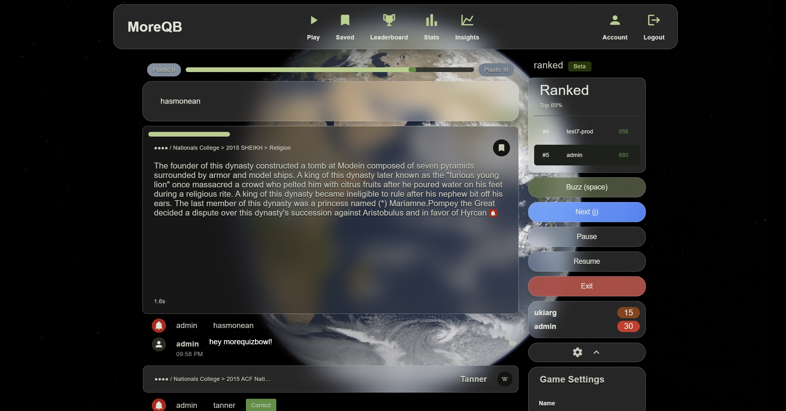
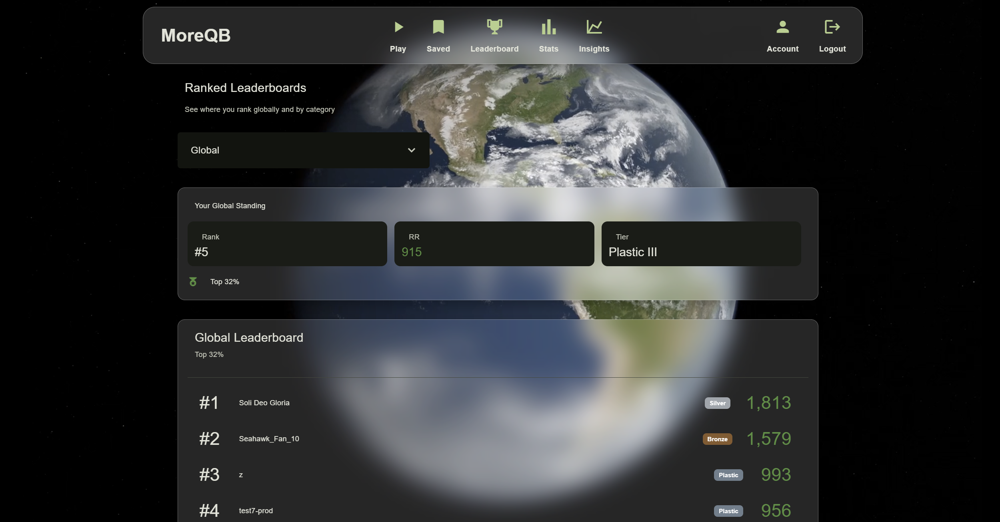
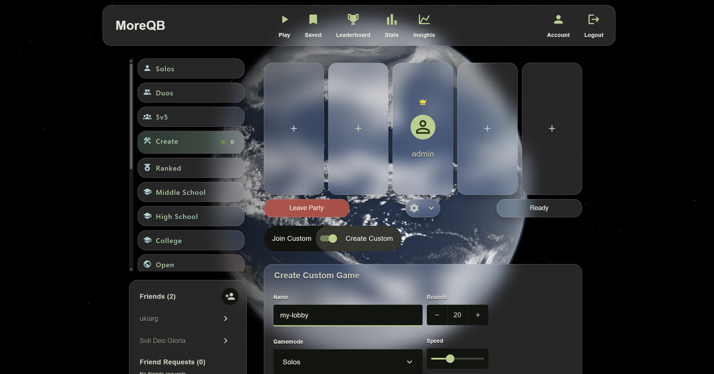
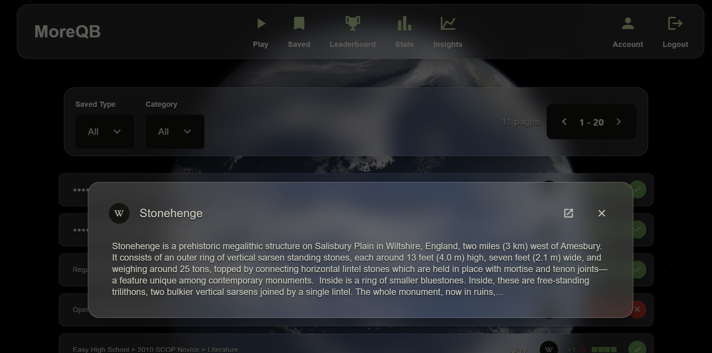

# MoreQuizBowl

MoreQuizBowl.com is a competitive platform for students who want to level up their trivia skills. Compete in ranked matches, track your progress, save questions, view analytics, and leverage built-in Wikipedia integrations to dive deeper into any topic. With thousands of questions, you'll never get stuck studying repeat knowledge.

---

## 🚀 What is MoreQuizBowl?

MoreQuizBowl is a multiplayer trivia platform built specifically for Quiz Bowl competitors. It combines real-time gameplay with powerful study tools to help students learn faster and perform better in tournaments.

---

## 🎯 Key Features

- Elo-based ranked algorithm (TrueSkill)
- Multiplayer lobbies with friends
- AI-powered gameplay analytics
- Correct / missed question tracking
- Integrated Wikipedia summaries and links for deeper learning

---

## 📸 Demo / Screenshots

### Gameplay

  

### Leaderboard / Rankings

  

### Multiplayer Lobby

  

### Wikipedia Integration

  

---

## 🧠 Why it's different

- Uses Xbox’s TrueSkill ranking system to accurately assess player skill
- Tracks performance across questions to reinforce learning over time
- Allows users to save and revisit missed or important questions
- Clean UI and smooth reading experience improve gameplay focus
- Built-in analytics highlight weaknesses and areas for improvement

---

## 🛠️ Tech Stack

- React Native (frontend)
- Flask (backend API)
- MySQL (database)
- Nginx (reverse proxy / static serving)

---

## 🔒 Security

- Passwords are salted and hashed with bcrypt (client-side before transit)
- Passwords are never stored in plaintext and cannot be decrypted
- Secure handling of user email data
- CORS policies restrict backend access to trusted origins
- Cloudflare tunneling protects backend services from direct exposure

---

## 🚧 Future Plans

- Repeat-question practice arena
- AI-generated flashcards (exportable to apps like Anki)
- Bonus question support (coming soon!)